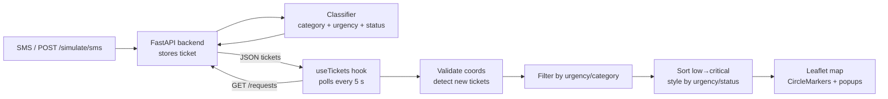

# Task 2 — Live Map View: Report & PPT Content

Draft text, ready to paste into the report (Times New Roman 12 body / 14 headings, single spacing). Replace "Fig. X" numbers once all chapters are merged.

---

## Chapter 3 — Map Component Description

The Live Map View is a web-based geographic interface built with React and Leaflet, an open-source JavaScript mapping library, using OpenStreetMap tiles as the base layer. It gives the relief coordinator a spatial overview of all incoming help requests, so that clusters of need and the most urgent cases can be identified at a glance.

Each ticket received by the backend is plotted as a circular marker at its reported latitude and longitude. Marker colour and size encode urgency (critical – red, high – orange, medium – yellow, low – green), and critical markers are always drawn on top so they are never hidden by lower-priority ones. Clicking a marker opens a popup showing the original message, category, status, phone number, time of receipt and coordinates. Tickets flagged as possible duplicates by the classification module are shown with a dashed outline, and tickets already assigned are faded.

The component provides filter chips to show or hide tickets by urgency and category, a legend, a manual refresh button, a "fit all" control that zooms to cover every ticket, and a status bar showing the number of tickets displayed, tickets without location, and the time of the last update.

**Software requirements (map module):** Node.js 18+, React 18, Leaflet 1.9, React-Leaflet 4, Vite 5, a modern web browser; internet access for OpenStreetMap tiles.

---

## Chapter 4 — Map Working Principle

1. **Data retrieval.** A custom React hook (`useTickets`) sends an HTTP GET request to the backend endpoint `/requests` when the page loads and then at a fixed interval (5 seconds by default). The response is a JSON object `{ "tickets": [...] }`.
2. **Validation.** Each ticket is checked for valid numeric coordinates (latitude −90 to 90, longitude −180 to 180). Tickets without a valid location are excluded from the map but counted separately so they are not silently lost.
3. **Change detection.** The hook compares ticket IDs from the current response with the previous one. Newly arrived tickets are marked so their markers pulse briefly, drawing the coordinator's attention.
4. **Filtering.** The coordinator's urgency and category selections are applied to the list.
5. **Ordering and styling.** Remaining tickets are sorted from low to critical urgency and drawn in that order, so critical markers render on top. A style lookup table maps urgency to colour and radius, and status to outline and opacity.
6. **Rendering.** React-Leaflet renders each ticket as a `CircleMarker` over the OpenStreetMap tile layer. On the first load the map automatically fits its bounds to include all markers; on later refreshes the view is left unchanged so the coordinator's panning is not interrupted.
7. **Fault tolerance.** If a refresh fails (e.g. backend unreachable), the last successfully loaded tickets remain on screen and an error message appears in the status bar.

**Fig. X: Map View — data flow**

*(Render this in draw.io / mermaid.live and paste as an image, or redraw in Canva.)*

**Table: Marker encoding**

| Attribute | Visual encoding |
|---|---|
| Urgency: critical / high / medium / low | Red / orange / yellow / green; largest → smallest |
| Status: flagged | Dashed dark outline |
| Status: assigned | Faded fill |
| New since last refresh | Pulsing outline |
| Category | Icon in tooltip and popup |

---

## Chapter 5 — Screenshots to take + captions

Take these with `VITE_USE_MOCK=false` and real backend data if possible (mock data is fine as a fallback).

| # | Screenshot | Caption / explanation |
|---|---|---|
| 1 | Full map with all tickets | Live Map showing all active help requests across the city, colour-coded by urgency. The critical-unassigned alert in the header shows how many critical cases still need action. |
| 2 | A popup opened on a critical marker | Clicking a marker shows the original SMS text, category, status, phone number and time of receipt, letting the coordinator assess the request without leaving the map. |
| 3 | Filters: only Critical + High selected | Urgency filters let the coordinator focus on the most severe requests during peak load. |
| 4 | Flagged ticket next to the original (Sector 3 water) | Possible duplicates detected by the classifier are shown with a dashed outline beside the original request. |
| 5 | Before / after running `POST /simulate/sms` | A new simulated SMS appears on the map within one refresh cycle and pulses to attract attention. |
| 6 | Backend stopped → status bar error | If the backend becomes unreachable, the last data stays visible and an error is shown, so the coordinator does not lose situational awareness. |

---

## Individual Contribution (Ch 4, half page) — draft

I was responsible for the Live Map View module of Raahat. I designed and implemented the map interface using React and the Leaflet library with OpenStreetMap tiles. My work included building a reusable map component that plots each help request at its reported location, defining the visual encoding of urgency through marker colour and size, and representing ticket status (flagged duplicates and assigned cases) through outline and opacity. I implemented a shared data hook that polls the backend `GET /requests` endpoint at a fixed interval, detects newly arrived tickets, and keeps the last valid data visible if the backend fails. I also added urgency and category filters, a legend, automatic map fitting, and handling for tickets with missing coordinates. To allow parallel development before the backend was ready, I created a mock-data mode with sample tickets matching the agreed API contract, and configured a development proxy so the frontend and backend could communicate without cross-origin issues. The map component and the styling utilities were written to be reused by the Coordinator Dashboard (Task 1), keeping colours and labels consistent across the system.

---

## PPT — 2 slides

### Slide: Live Map View (module)
**Title:** Live Map View
- React + Leaflet + OpenStreetMap
- Every request plotted at its location
- Colour & size = urgency (critical → low)
- Dashed ring = flagged duplicate · faded = assigned
- Auto-refresh every 5 s from `GET /requests`
- Filters by urgency & category, legend, popups

*Visual:* screenshot #1 on the right half.

### Slide: Map Demo Walkthrough
1. Open map → all active tickets, critical alert in header
2. Send `POST /simulate/sms` ("NEED WATER SECTOR 3")
3. New marker appears within 5 s and pulses
4. Click it → popup with message, category, urgency, status
5. Filter to Critical only → focus view
6. Duplicate request shows dashed ring beside original

*Visual:* screenshots #2 and #5 side by side.
